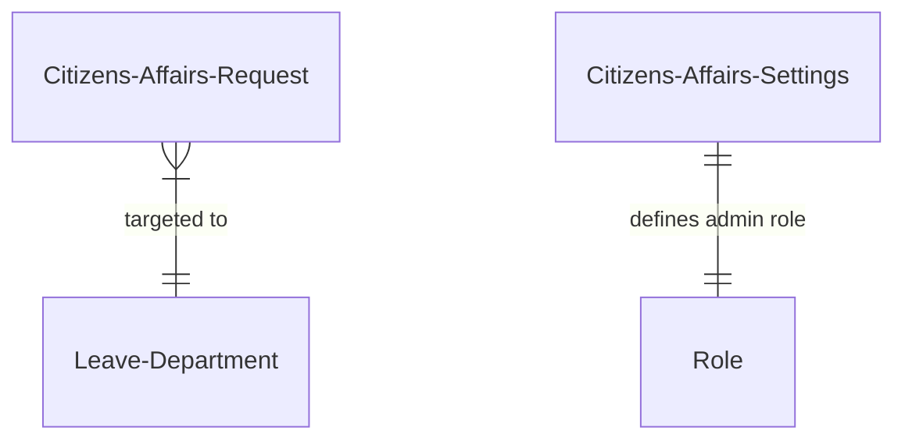
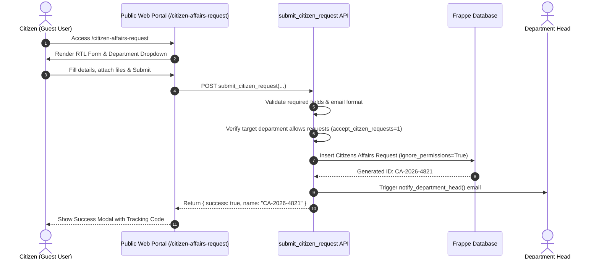

# UoT Citizen Affairs System - Technical Handover Document

## 1. Overview & Objectives

The **UoT Citizen Affairs System** (`citizen_affairs`) is a specialized module built within the `uotelafer_leave_management` Frappe app for the **University of Telafer (جامعة تلعفر)**. It provides a public-facing portal for citizens, students, and employees to submit inquiries, complaints, or official requests (شؤون المواطنين) directly to university departments without needing an account, while giving university administrators a centralized management dashboard to process, track, respond to, and archive requests.

### Key Capabilities
- **Public Guest Portal**: Unauthenticated submission portal accessible at `/citizen-affairs-request`.
- **Automated Reference Tracking**: Auto-generated tracking IDs (format: `CA-2026-XXXX`).
- **Instant Status Lookup**: Public lookup drawer allowing citizens to check request status using their tracking code.
- **Department Head Notifications**: Automatic email dispatch to target department heads upon new request submissions.
- **Administrative Desk Management**: Custom Frappe Desk page (`citizens_affairs_mgm`) with KPI metrics, status filters, and search.
- **Structured Processing Workflows**: Dedicated actions for Accepting (`accept_citizen_request`), Rejecting (`reject_citizen_request`), or Replying (`reply_to_request`) with automated HTML email dispatch.
- **Official Print Form**: Formatted Arabic printable document (`citizen_affairs_form`) for physical archiving and signature routing.

---

## 2. System Architecture & Routing

```
apps/uotelafer_leave_management/uotelafer_leave_management/
├── hooks.py                             # Website route rules & guest API whitelist
├── citizen_affairs/                     # Main Citizen Affairs Module
│   ├── doctype/
│   │   ├── citizens_affairs_request/    # Primary Request DocType & backend APIs
│   │   └── citizens_affairs_settings/   # Module configuration & admin role assignment
│   ├── page/
│   │   ├── citizens_affairs_mgm/        # Admin Desk Management Dashboard (JS/Py/CSS)
│   │   └── citizens_cffairs_req/        # Desk page wrapper
│   └── print_format/
│       └── citizen_affairs_form/        # Official print format metadata
└── templates/pages/
    ├── citizen_affairs_request.html     # Public web submission page template
    └── citizen_affairs_request.py       # Context handler for public page
```

### Route Configuration (`hooks.py`)
```python
website_route_rules = [
    {"from_route": "/citizen-affairs-request", "to_route": "citizen_affairs_request"},
]

guest_methods = [
    "uotelafer_leave_management.citizen_affairs.doctype.citizens_affairs_request.citizens_affairs_request.submit_citizen_request"
]
```

---

## 3. Data Model & Core DocTypes



### 3.1 `Citizens Affairs Request` (`doctype/citizens_affairs_request`)

The core DocType representing each citizen inquiry or complaint.

#### Schema Breakdown

| Category | Field Name | Type | Description |
| :--- | :--- | :--- | :--- |
| **Identification** | `name` | Data | Primary key / tracking reference code (`CA-YYYY-####`) |
| **Applicant Info** | `full_name` | Data | Full 4-part name of the applicant |
| | `address_area` | Data | Residential area / address |
| | `occupation` | Data | Job title / occupation |
| | `phone_number` | Data | Contact phone number |
| | `email` | Data | Email address for notifications |
| **Request Info** | `target_department` | Link (`Leave Department`) | Recipient university department |
| | `request_subject` | Data | Subject title of the request |
| | `request_details` | Small Text | Comprehensive description of the request |
| | `attachment_1` / `attachment_2` | Attach | Uploaded supporting documents/scans |
| | `applicant_pledge` | Check | Legal accuracy pledge (1 = Agreed) |
| | `applicant_signature_name` | Data | Electronic signature name |
| | `applicant_submission_date`| Date | Date submitted by applicant |
| **Processing & Decision** | `status` | Select | `Open`, `Replied`, `Accepted`, `Rejected` |
| | `decision` | Select | Official decision summary |
| | `rejection_reasons` | Small Text | Detailed justification if rejected |
| | `recommendation` | Small Text | Committee / officer recommendation notes |
| | `receiver_name` | Data | Name of officer receiving/logging request |
| | `receipt_date` | Date | Date logged in system |
| | `ca_officer_name` | Data | Citizen Affairs officer signature name |
| | `ca_officer_date` | Date | Action execution date |
| | `reply_text` | Small Text | Text response sent to citizen |
| | `replied_by` | Link (`User`) | User who replied |
| | `replied_on` | Datetime | Timestamp of response |

---

### 3.2 `Citizens Affairs Settings` (`doctype/citizens_affairs_settings`)
Single DocType managing global settings for Citizen Affairs:
- **`citizens_affairs_manager`** (Link `Role`): Specifies the executive role (default: `Citizen Affairs Manager`) granted full administrative control over all citizen requests across all departments.

---

### 3.3 `Leave Department` Integration
Extended with a custom checkbox:
- **`accept_citzen_requests`** (`Check`): Controls whether a department appears in the public drop-down list on `/citizen-affairs-request`.

---

## 4. Public Web Portal & Guest Submission Workflow



### Guest Submission API (`submit_citizen_request`)
- **Endpoint**: `@frappe.whitelist(allow_guest=True)`
- **Validations**:
  1. Ensures all required fields (`full_name`, `target_department`, `request_details`, `phone_number`, `email`) are present.
  2. Confirms target department exists and has `accept_citzen_requests == 1`.
  3. Validates email regex pattern.
- **Execution**: Instantiates doc with `status="Open"`, calls `doc.insert(ignore_permissions=True)`, commits transaction, and returns reference code.

---

## 5. Administrative Desk Portal (`citizens_affairs_mgm`)

The custom Desk page `citizens_affairs_mgm` (`page/citizens_affairs_mgm`) provides the central operations center for Citizen Affairs Officers and Department Heads.

### Key Capabilities
1. **KPI Metric Cards**: Displays counts for Total Requests, Open/Pending, Accepted, Rejected, and Replied.
2. **Filter & Search Bar**: Filter by target department, request status, and date ranges (From/To).
3. **Request List & Card View**: Interactive list showing applicant details, submission date, status badge, and attachment previews.
4. **Processing Action Modals**:
   - **Accept Modal** (`accept_citizen_request`): Set receipt date, receiver name, recommendation notes, and CA officer name. Automatically dispatches an HTML acceptance email to the citizen.
   - **Reject Modal** (`reject_citizen_request`): Enforces entry of `rejection_reasons`. Automatically dispatches an HTML rejection email containing the detailed rationale.
   - **Reply Modal** (`reply_to_request`): Allows typing a direct response text to be emailed to the citizen, setting status to `Replied`.

---

## 6. Email Notification System

The module features formatted HTML emails sent via `frappe.sendmail(..., now=True)`:

1. **New Request Notification to Department Head**:
   - Triggered in `after_insert() -> notify_department_head()`.
   - Sends notification containing request details, applicant info, and direct link to review.
2. **Acceptance Email to Citizen**:
   - Sent when request is accepted. Contains official acceptance badge, officer name, and instructions.
3. **Rejection Email to Citizen**:
   - Sent when request is rejected. Highlighted in red styling with the exact rejection grounds provided by the officer.
4. **Direct Reply Email to Citizen**:
   - Sent when an officer posts a reply text.

---

## 7. Security, Roles & Access Control

Access control is managed dynamically in Python via helper functions:

| Function | Purpose / Rules |
| :--- | :--- |
| `_is_citizen_affairs_admin(user)` | Returns `True` if user has `System Manager` role or the role defined in `Citizens Affairs Settings.citizens_affairs_manager`. Allows full system-wide access. |
| `_get_user_departments(user)` | Fetches departments where the user is assigned as Department Head or Approver in `Leave Settings`. |
| `_can_manage_request(doc)` | Returns `True` if current user is Citizen Affairs Admin OR belongs to the `target_department` of the request. |

---

## 8. Print Format & Archival Documentation

The module includes an official printable format:
- **`citizen_affairs_form`** (`print_format/citizen_affairs_form`):
  - Formatted Arabic document layout (نموذج استمارة شؤون المواطنين).
  - Includes University of Telafer header, applicant personal information grid, request summary, committee recommendation section, official decision box, receiver/officer signatures, and tracking reference code.

---

## 9. Operational & Developer Guide

### Setup & Onboarding Checklist
1. **Enable Departments for Citizen Requests**:
   - Navigate to Desk -> **Leave Department**.
   - Open target department (e.g., "قسم الشؤون الإدارية").
   - Check **Accept Citizen Requests** (`accept_citzen_requests = 1`) and save.
2. **Configure Citizen Affairs Admin Role**:
   - Navigate to Desk -> **Citizens Affairs Settings**.
   - Select the designated role in **Citizens Affairs Manager** (e.g., `Citizen Affairs Manager`).
   - Assign this role to authorized staff.
3. **Testing Guest Submissions**:
   - Open browser in incognito mode and navigate to `http://<your-site>/citizen-affairs-request`.
   - Complete form submission and copy reference code `CA-YYYY-####`.
   - Test lookup drawer to verify live tracking.
