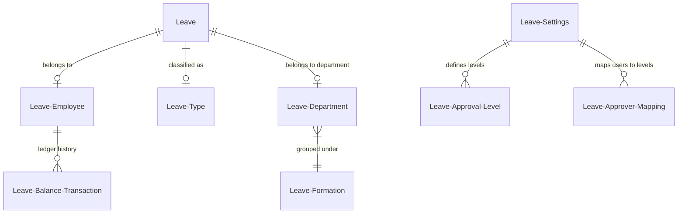
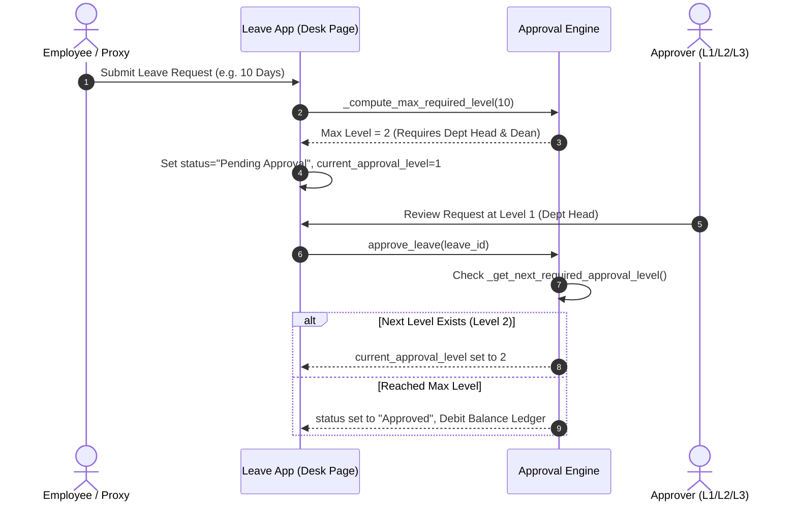

# UoT Leave Management System - Technical Handover Document

## 1. Overview & Objectives

The **UoT Leave Management System** (`uotelafer_leave_management`) is a custom Frappe v15 application developed for the **University of Telafer (جامعة تلعفر)**. It provides an end-to-end digital solution for managing academic and administrative employee leave requests, dynamic multi-level approval workflows, leave balance ledgers, and official printable forms with QR code verification.

### Key Capabilities
- **Employee Leave Requests**: Direct online submission by employees or proxy submission by authorized staff.
- **Dynamic Multi-Level Approval Engine**: Configurable 1 to N approval levels based on leave duration (days) and organizational unit.
- **Formation & Department Scoping**: Supports complex university organizational hierarchies (Colleges, Deanships, Centers, Departments, Formations).
- **Balance Ledger & Audit Trail**: Real-time leave balance tracking with transactional history (`Leave Balance Transaction`).
- **Granular Permission Architecture**: Row-level database query filtering (`get_permission_query_conditions`) and document permission checks (`has_permission`).
- **Official Print & Verification**: Styled Arabic print forms (`pf.html` / `leave_print_form`) featuring instant Base64 SVG QR code generation for authenticity verification.

---

## 2. System Architecture & File Structure

The leave management module is contained within the `uotelafer_leave_management` Frappe app.

```
apps/uotelafer_leave_management/
├── pyproject.toml
├── hooks.py                             # Frappe hooks (permissions, Jinja methods, fixtures)
├── utils.py                             # Base64 SVG QR code generator
├── uotelafer_leave_management/
    ├── modules.txt                      # Declared modules
    ├── uotelafer_leave_management/      # Main Leave Management Module
    │   ├── doctype/                     # Core DocTypes
    │   │   ├── leave/                   # Main Leave request document & permissions
    │   │   ├── leave_type/              # Leave type configuration
    │   │   ├── leave_employee/          # Employee profiles & balance records
    │   │   ├── leave_department/        # Department organizational units
    │   │   ├── leave_formation/         # Formations / Higher organizational scope
    │   │   ├── leave_settings/          # Global settings, approval levels, approver mappings
    │   │   ├── leave_balance_transaction/# Balance audit trail ledger
    │   │   ├── bulk_leave_balance_tool/ # Mass balance allocation utility
    │   │   └── ...                      # Supporting DocTypes
    │   ├── page/                        # Custom Frappe Desk Dashboards
    │   │   ├── leave_managment/         # Primary Leave Desk Dashboard (JS/Py/CSS)
    │   │   └── balance_and_employee/    # Balance & Employee Management Desk Page
    │   ├── print_format/
    │   │   └── leave_print_form/        # Official print format metadata
    │   └── report/
    │       └── employee_leaves_report/  # Leave analytical script reports
    └── templates/
        └── pf.html                      # Official printable HTML template (Jinja + CSS)
```

---

## 3. Data Model & Core DocTypes



### 3.1 `Leave` (`doctype/leave/leave.py`)
The primary transaction document created whenever an employee requests leave.

| Field Name | Type | Description |
| :--- | :--- | :--- |
| `employee` | Link (`User`) | Target employee user ID |
| `employee_fullname` | Data | Full name of the employee |
| `dep` | Link (`Leave Department`) | Assigned leave department |
| `leave_type` | Link (`Leave Type`) | Selected leave type (Annual, Sick, etc.) |
| `from_date` / `to_date` | Date | Start and end dates of the leave |
| `total_leave_days` | Float | Calculated leave duration in days |
| `reason` | Small Text | Justification/details for the request |
| `status` | Select | `Draft`, `Pending Approval`, `Approved`, `Rejected`, `Cancelled` |
| `current_approval_level` | Int | Current level step in the approval pipeline |
| `max_approval_level` | Int | Calculated maximum level required for this request |
| `is_proxy_submission` | Check | Flag set if submitted on behalf of an employee |
| `submitted_by_proxy` | Link (`User`) | User who submitted the request as proxy |
| `attachment` | Attach | Medical report or official document attachment |

**Key Methods & Lifecycle (`leave.py`)**:
- `on_update()`: Automatically creates a `Leave Employee` profile on initial save if one does not exist for the user. Automatically deletes associated balance transactions if the leave is set to `Rejected`.
- `autoname()`: Generates sequential naming series formatted with the department's formation (e.g., `LEAVE-MED-2026-00001`).

---

### 3.2 `Leave Type` (`doctype/leave_type`)
Defines the categories and rules of leaves:
- **Attributes**: `requires_attachment`, `max_days_per_year`, `gender_restriction`, `is_paid`, `is_carry_forwardable`.

### 3.3 `Leave Employee` (`doctype/leave_employee`)
Stores employee metadata and leave balance within the app:
- **Attributes**: `user` (Link User), `full_name`, `leave_department`, `current_balance`, `hire_date`, `job_title`.

### 3.4 `Leave Department` & `Leave Formation` (`doctype/leave_department`, `doctype/leave_formation`)
Organizational units:
- **`Leave Department`**: Represents specific departments (e.g., Department of Computer Science, HR Division). Includes field `accept_citzen_requests`.
- **`Leave Formation`**: Higher-level grouping (e.g., College of Engineering, University Presidency) used for defining approval scopes.

### 3.5 `Leave Settings` (`doctype/leave_settings`)
Single DocType storing global app configurations:
- **`approval_levels`** (Child Table: `Leave Approval Level`): Defines `level` (1, 2, 3...), `level_name` (e.g., "رئيس القسم", "عميد الكلية", "رئيس الجامعة"), `min_days`, and `max_days`.
- **`approver_mappings`** (Child Table: `Leave Approver Mapping`): Maps a `user` to an `approval_level` within a specific `formation` or explicit `department`.
- **`department_visibility`** (Child Table: `Leave Department Visibility`): Defines custom visibility scopes for Follow-Up and HR employees.

### 3.6 `Leave Balance Transaction` (`doctype/leave_balance_transaction`)
Ledger table recording every credit/debit transaction:
- **Fields**: `employee`, `date`, `transaction_type` (`Credit`, `Debit`, `Adjustment`), `amount`, `balance_after`, `leave_doc`, `note`.

---

## 4. Multi-Level Approval Engine Implementation

The approval logic is implemented in `leave_managment.py` and mirrored in `leave.py`.



### Dynamic Level Computation Logic (`_compute_max_required_level(days)`)
1. Fetches all configured `approval_levels` sorted by level number.
2. Evaluates leave duration (`days`) against `min_days` and `max_days` thresholds for each level.
3. Example Configuration:
   - **Level 1** (Department Head): 1 - 3 Days
   - **Level 2** (Dean / Director): 4 - 14 Days
   - **Level 3** (University President): > 14 Days
4. If a leave is 5 days, the engine requires approval up to Level 2.

### Level Gap & Formation Routing (`_get_next_required_approval_level()`)
If a specific department does not have a Level 2 approver mapped in `approver_mappings`, the engine dynamically routes the request from Level 1 directly to Level 3 without breaking the workflow pipeline.

---

## 5. Security & Permission Architecture

Permission handling relies on standard Frappe hooks defined in `hooks.py`:

```python
permission_query_conditions = {
    "Leave": "uotelafer_leave_management.uotelafer_leave_management.doctype.leave.leave.get_permission_query_conditions"
}

has_permission = {
    "Leave": "uotelafer_leave_management.uotelafer_leave_management.doctype.leave.leave.has_permission"
}
```

### Role Access Breakdown

| Role | Scope / Access Level |
| :--- | :--- |
| **System Manager** | Full access to all leaves, settings, and doctypes. |
| **University Employee** | Can only view and edit their own leaves (`employee == user` or `owner == user`). |
| **Leave Proxy Submitter** | Can submit leaves on behalf of employees and view submitted leaves. |
| **Department Head / Approver** | Can view and approve leaves for departments mapped in `approver_mappings`. |
| **Follow Up Employee / HR** | View-only access across assigned departments/formations defined in `department_visibility`. |

---

## 6. Custom Desk Pages & User Interfaces

### 6.1 `leave_managment` Desk Page (`page/leave_managment`)
Custom JavaScript & Python page providing the primary management dashboard for employees and approvers.

- **Frontend (`leave_managment.js`, `leave_managment.css`)**:
  - **Tabs**: "طلباتي" (My Leaves), "بانتظار الموافقة" (Pending Approval), "جميع الإجازات" (All Leaves), and "التقويم" (Calendar View).
  - **Action Modals**: Approve modal, Reject modal with required reason input, and Proxy Leave Submission modal.
  - **Status Counters**: Real-time badges for Pending, Approved, and Rejected counts.
- **Backend API (`leave_managment.py`)**:
  - `get_leave_dashboard_data()`: Returns filtered leaves based on user role and active tab.
  - `approve_leave(leave_name)`: Increments approval level or finalizes approval.
  - `reject_leave(leave_name, reason)`: Rejects request and cleans up balance ledger entries.
  - `submit_leave(data)`: Handles new request submissions with validation.

### 6.2 `balance_and_employee` Desk Page (`page/balance_and_employee`)
Dashboard for HR and administrative staff to manage employee balances.
- Features employee search, manual balance adjustments (add/subtract days), audit log modal, and batch balance allocation tools.

---

## 7. Print Format & Verification System

Official leave documents are printed using the `leave_print_form` print format (`templates/pf.html`).

### Key Features
- **Official University Layout**: Styled for A4 paper in Arabic (RTL) with official University of Telafer branding.
- **Dynamic Signature Blocks**: Displays signatures and timestamps for each approval level (Department Head, Dean, President).
- **QR Code Authenticity Verification**:
  - Generated via `utils.get_qr_code(data)` registered as a Jinja method in `hooks.py`.
  - Converts document verification data into a Base64-encoded SVG QR code rendered directly inside `pf.html`:
    ```jinja2
    
    ```

---

## 8. Fixtures & Installed Roles

Configured in `hooks.py`:
- **Roles**: `University Employee`, `University President`, `Department Head`, `Follow Up Employee`, `HR Employee`, `Leave Proxy Submitter`.
- **Workspaces & Custom HTML Blocks**: Default dashboard blocks and workspace shortcuts ("اضافة اجازة جديدة").
- **Translations**: Arabic/English terms.

---

## 9. Maintenance & Developer Guidelines

### Common Maintenance Tasks
1. **Adding a New Approval Level**:
   - Go to Desk -> **Leave Settings**.
   - Add a row to the **Approval Levels** table (set Level number, Name, Min Days, Max Days).
   - Add corresponding entries in **Approver Mappings** linking users to the new level.
2. **Onboarding a New Department**:
   - Create entry in **Leave Department**.
   - Assign the appropriate **Formation**.
   - Map the Department Head in **Leave Settings -> Approver Mappings**.
3. **Exporting Fixtures**:
   ```bash
   bench --site [site-name] export-fixtures
   ```
